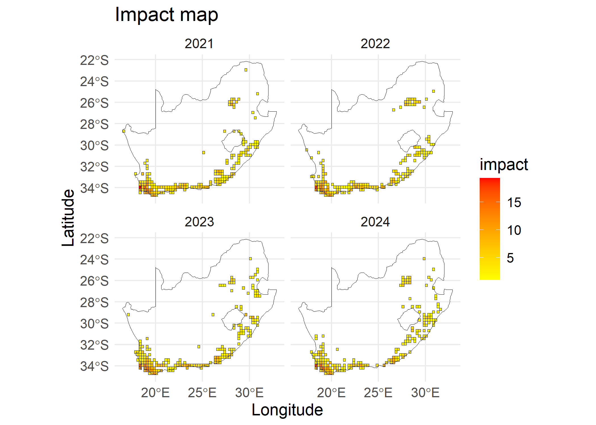
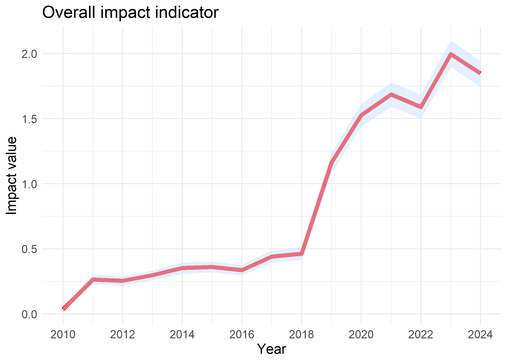
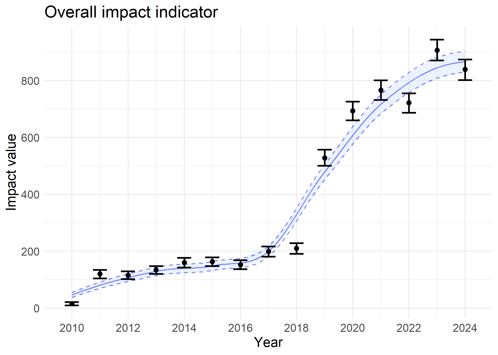
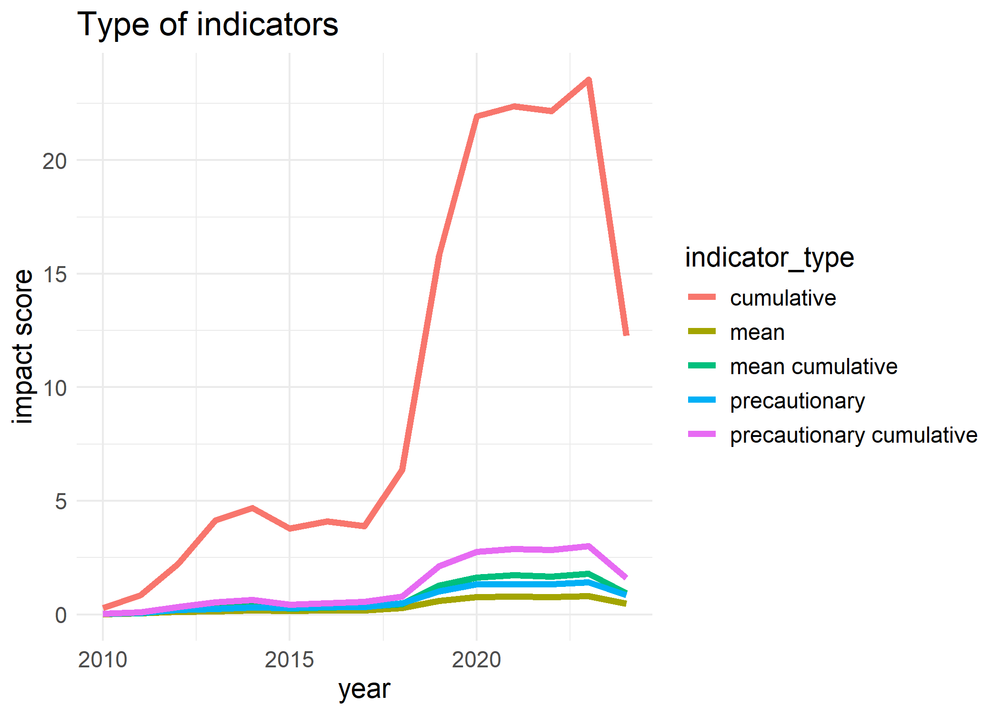

<!-- README.md is generated from README.Rmd. Please edit that file -->

# impIndicator 

<!-- badges: start -->

[](https://github.com/b-cubed-eu/impIndicator/actions/workflows/R-CMD-check.yaml)
[](https://www.repostatus.org/#wip)
<!-- badges: end -->

The goal of **impIndicator** is to allow users to seamlessly calculate
and visualise the impact of alien taxa and individual species in a given
area. It calculates and visualises impact per site as a map. It takes in
GBIF occurrence data and EICAT assessment list. It enables users to
choose from various methods of calculating impact indicators based on
different studies.  

The impIndicator produces three main products and can be useful as
stated below:  
- **impact indicator** \<`impact_indicator()`\>  
The impact indicator offers a nuanced representation of the trends of
biological invasions of an area (local, regional, or global scales). By
tracking the increase and decrease of ecological threats over time, this
product provides insights into the dynamics of invasive alien species
impacts, helping assess whether current management practices are
effective or need adjustment. The temporal analysis of impact indicator
enables targeted resource allocation, fostering proactive interventions
to mitigate biodiversity loss and ecosystem degradation.  
- **site impact** \<`site_indicator()`  
The site impact as a map serves as a visual and analytical tool to
represent the intensity of biological invasions across different parts
of an area. By enabling spatial comparisons—such as between provinces,
states, or conservation areas—it highlights hotspots and areas at risk
of invasion impact. This spatial data is useful for prioritising
management actions, coordinating restoration projects, and fostering
cross-regional collaboration to address invasive species impacts
effectively.  
- **species impact** \<`species_impact()`  
The species impact produces the trends of individual invasive alien
species, enabling a species-specific impact caused by invasions. This
data supports comparisons of individual species’ impacts, revealing
their roles and interactions within invaded area. The species impact is
invaluable for prioritising species-specific management efforts,
informing eradication strategies, and advancing research on alien
species’ ecological roles and adaptation patterns.

## Installation

You can install the development version of impIndicator from
[GitHub](https://github.com/b-cubed-eu/impIndicator) with:

``` r
# install.packages("remotes")
remotes::install_github("b-cubed-eu/impIndicator")
```

## Demonstration

This Markdown demonstrates the computation and visualisation of impact
indicator of biological invasions using the `impact_indicator()` to
compute impact indicator of alien taxa, the `species_impact()` to
compute impact indicator per species, and the `site_impact()` to compute
impact indicator per site. The functions feeds in species GBIF
occurrence cube from the `b3gbi::process_cube()` using `taxa_cube()`
and  
Environmental Impact Classification of Alien Taxa (EICAT) impact score
of species. Read about the background of the products at
<https://b-cubed-eu.github.io/impIndicator/articles/Background.html>

``` r
# Load packages
library(impIndicator)

library(b3gbi) # Biodiversity indicators for data cubes
library(tidyverse) # Data wrangling and visualisation
library(sf) # Spatial features
```

## Process occurrence cube

``` r
# load the GBIF occurrence data for taxa

acacia_cube <- taxa_cube(
  taxa = taxa_Acacia,
  region = southAfrica_sf,
  res = 0.25,
  first_year = 2010
)

acacia_cube
#> 
#> Simulated data cube for calculating biodiversity indicators
#> 
#> Date Range: 2010 - 2024 
#> Number of cells: 369 
#> Grid reference system: custom 
#> Coordinate range:
#> [1] 16.60833
#> 
#> Total number of observations: 5559 
#> Number of species represented: 25 
#> Number of families represented: Data not present 
#> 
#> Kingdoms represented: Data not present 
#> 
#> First 10 rows of data (use n = to show more):
#> 
#> # A tibble: 5,559 × 8
#>    scientificName   taxonKey minCoordinateUncerta…¹  year cellCode xcoord ycoord
#>    <chr>               <dbl>                  <dbl> <dbl>    <int>  <dbl>  <dbl>
#>  1 Acacia implexa    2979232                      1  2010      206   18.4  -33.9
#>  2 Acacia cyclops    2980425                    122  2010      668   18.4  -32.2
#>  3 Acacia saligna    2978552                      1  2010      206   18.4  -33.9
#>  4 Acacia pycnantha  2978604                      1  2010      206   18.4  -33.9
#>  5 Acacia mearnsii   2979775                    110  2010      215   20.6  -33.9
#>  6 Acacia mearnsii   2979775                      1  2010      215   20.6  -33.9
#>  7 Acacia mearnsii   2979775                      8  2010     1376   30.4  -29.7
#>  8 Acacia saligna    2978552                      1  2011      206   18.4  -33.9
#>  9 Acacia saligna    2978552                     15  2011     1312   30.9  -29.9
#> 10 Acacia mearnsii   2979775                      1  2011      230   24.4  -33.9
#> # ℹ 5,549 more rows
#> # ℹ abbreviated name: ¹​minCoordinateUncertaintyInMeters
#> # ℹ 1 more variable: obs <dbl>
```

## EICAT data

An example of an EICAT data is:

``` r
# view EICAT data. Convert to tibble for a nicer display
head(as_tibble(eicat_data),10)
#> # A tibble: 10 × 4
#>    scientific_name   impact_category impact_mechanism                probability
#>    <chr>             <chr>           <chr>                                 <dbl>
#>  1 Acacia saligna    MC              (1) Competition                           0
#>  2 Acacia saligna    MC              (12) Indirect impacts through …           0
#>  3 Acacia saligna    MC              (1) Competition                           0
#>  4 Acacia saligna    MC              (1) Competition; (9) Chemical …           0
#>  5 Acacia mearnsii   MC              (6) Poisoning/toxicity                    0
#>  6 Acacia longifolia MC              (9) Chemical impact on ecosyst…           0
#>  7 Acacia dealbata   MC              (9) Chemical impact on ecosyst…           0
#>  8 Acacia dealbata   MC              (9) Chemical impact on ecosyst…           0
#>  9 Acacia saligna    MC              (9) Chemical impact on ecosyst…           0
#> 10 Acacia dealbata   MC              (12) Indirect impacts through …           0
```

## Compute impact map

The impact risk map shows the impact score for each site, where multiple
species can be present. To compute the impact risk per site, aggregated
scores across species at each site are needed. The `site_impact()` uses
*max*, *sum* and *mean* metrics to aggregate impact scores across
species as proposed by Boulesnane-Guengant et al., (in preparation). The
combinations of within species aggregation metrics for each species and
across species for each site leads to five type of indicators, namely,
**precautionary**, **precautionary cumulative**, **mean**, **mean
cumulative** and **cumulative**.  

``` r
siteImpact <- site_impact(
  cube = acacia_cube,
  impact_data = eicat_data,
  col_category = "impact_category",
  col_species = "scientific_name",
  col_mechanism = "impact_mechanism",
  trans = 1,
  type = "mean cumulative"
)

# impact map
# visualize last four years for readability
plot(x = siteImpact, region = southAfrica_sf, first_year = 2021)
```



## Compute impact indicators

To compute the impact indicator of alien taxa, we sum all the yearly
impact scores of each site of the study region. To correct for sampling
effort we divide the yearly impact scores by number of sites in the
study region with at least a single occurrence throughout the whole
year.

``` r
# impact indicator

impactIndicator <- impact_indicator(
  cube = acacia_cube,
  impact_data = eicat_data,
  col_category = "impact_category",
  col_species = "scientific_name",
  col_mechanism = "impact_mechanism",
  trans = 1,
  type = "mean cumulative"
)
# visualise impact indicator
plot(impactIndicator)
```



## Impact indicator per species

We compute the impact indicator per species by summing the impact risk
map per species and correct for sampling effort by dividing by $N$.

``` r
#  impact indicator per species

species_value <- species_impact(
  cube = acacia_cube,
  impact_data = eicat_data,
  col_category = "impact_category",
  col_species = "scientific_name",
  col_mechanism = "impact_mechanism",
  trans = 1,
  type = "mean"
)

# visualise species impact
plot(species_value)
#> Warning: Removed 9 rows containing missing values or values outside the scale range
#> (`geom_line()`).
```



# Comparing type of indicators

To compare type of impact indicators for a case study, we provide a plot
which can be adapted by a user to compare a set of method.

``` r
# plot all type of impact indicators
types <- c(
  "precautionary",
  "precautionary cumulative",
  "mean",
  "mean cumulative",
  "cumulative"
)

all_impact <- data.frame("year" = unique(acacia_cube$data$year))
for (type in types) {
  impact_value <- impact_indicator(
    cube = acacia_cube,
    impact_data = eicat_data,
    col_category = "impact_category",
    col_species = "scientific_name",
    col_mechanism = "impact_mechanism",
    trans = 1,
    type = type
  )

  all_impact[type] <- impact_value$value
}

#plot the trend
all_impact %>%
  gather(-year, key = "indicator_type", value = "impact_score") %>%
  ggplot(aes(x = year, y = impact_score)) +
  geom_line(aes(color = indicator_type), linewidth = 1.5) +
  theme_minimal() +
  labs(
    title = "Type of indicators",
    y = "impact score"
  ) +
  theme(text = element_text(size = 14))
```


