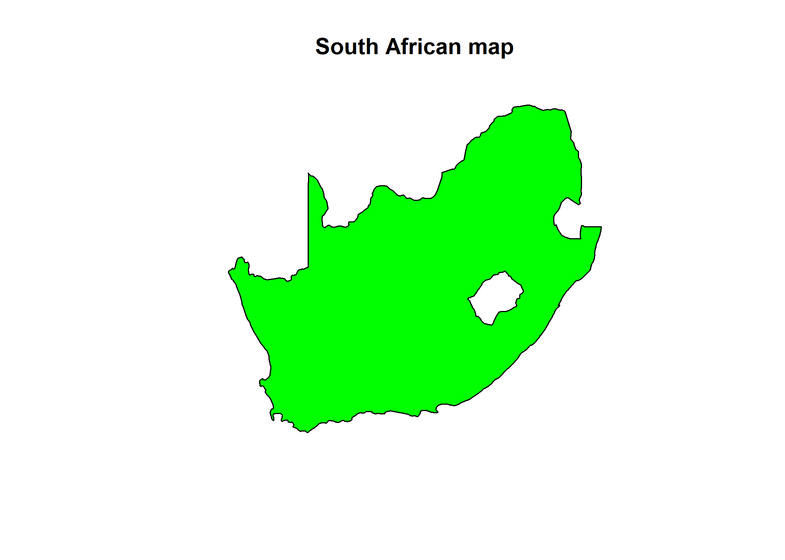
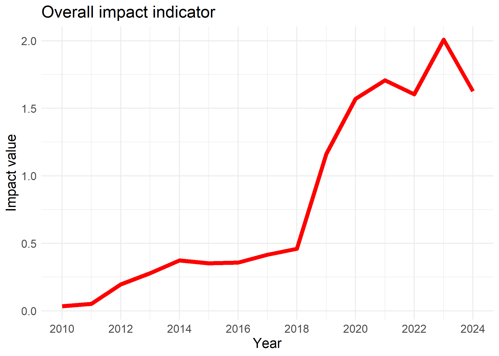
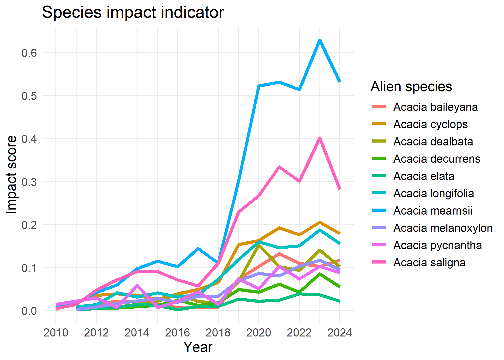

<!-- README.md is generated from README.Rmd. Please edit that file -->

# impIndicator

<!-- badges: start -->
<!-- badges: end -->

The goal of **impIndicator** is to allow users to seamlessly calculate
and visualize the impact of alien taxa and individual species in a study
area. Calculates and visualize impact per site as a map. Takes in GBIF
occurrence data and EICAT assessment list. Enables user to choose from
various methods of computing impact indicators from different studies.

## Installation

You can install the development version of impIndicator from
[GitHub](https://github.com/b-cubed-eu/impIndicator) with:

``` r
# install.packages("remotes")
remotes::install_github("b-cubed-eu/impIndicator")
```

## Demonstration

This Markdown demonstrates the computation and visualization of impact
indicator of biological invasions using the `impact_indicator()` to
compute impact indicator of alien taxa, the `species_impact()` to
compute impact indicator per species, and the `site_impact()` to compute
impact indicator per site. The functions feeds in species GBIF
occurrence cube from the `b3gbi::process_cube()` using `taxa_cube()`
and  
Environmental Impact Classification of Alien Taxa (EICAT) impact score
of species using `impact_cat()`.

``` r
# Load packages
library(impIndicator)

library(b3gbi)       # Biodiversity indicators for data cubes
library(tidyverse)   # Data wrangling and visualisation
#> ── Attaching core tidyverse packages ──────────────────────── tidyverse 2.0.0 ──
#> ✔ dplyr     1.1.4     ✔ readr     2.1.5
#> ✔ forcats   1.0.0     ✔ stringr   1.5.1
#> ✔ ggplot2   3.5.1     ✔ tibble    3.2.1
#> ✔ lubridate 1.9.3     ✔ tidyr     1.3.1
#> ✔ purrr     1.0.2     
#> ── Conflicts ────────────────────────────────────────── tidyverse_conflicts() ──
#> ✖ dplyr::filter() masks stats::filter()
#> ✖ dplyr::lag()    masks stats::lag()
#> ℹ Use the conflicted package (<http://conflicted.r-lib.org/>) to force all conflicts to become errors
library(sf)          # Spatial features
#> Linking to GEOS 3.12.1, GDAL 3.8.4, PROJ 9.3.1; sf_use_s2() is TRUE


# Source functions
source("R/taxa_cube.R")
source("R/impact_category.R")
source("R/impact_indicator.R")
source("R/species_impact.R")
source("R/site_impact.R")
```

``` r
# load the shapefile for study region
load("data/southAfrica_sf.rda")
plot(southAfrica_sf, main = "South African map")
```



# Process occurrence cube

``` r
# load the GBIF occurrence data for taxa
load("data/taxa_Acacia.rda")
acacia_cube<-taxa_cube(taxa=taxa_Acacia,
                    region=southAfrica_sf,
                    res=0.25,
                    first_year=2010)

acacia_cube$cube
#> 
#> Simulated data cube for calculating biodiversity indicators
#> 
#> Date Range: 2010 - 2024 
#> Number of cells: 369 
#> Grid reference system: custom 
#> Coordinate range:
#> [1] "Coordinates not provided"
#> 
#> Total number of observations: 5559 
#> Number of species represented: 25 
#> Number of families represented: Data not present 
#> 
#> Kingdoms represented: Data not present 
#> 
#> First 10 rows of data (use n = to show more):
#> 
#> # A tibble: 5,559 × 6
#>    scientificName   taxonKey minCoordinateUncertaintyInMe…¹  year cellCode   obs
#>    <chr>               <dbl>                          <dbl> <dbl>    <int> <dbl>
#>  1 Acacia implexa    2979232                              1  2010      206     1
#>  2 Acacia cyclops    2980425                            122  2010      668     1
#>  3 Acacia saligna    2978552                              1  2010      206     1
#>  4 Acacia pycnantha  2978604                              1  2010      206     1
#>  5 Acacia mearnsii   2979775                            110  2010      215     1
#>  6 Acacia mearnsii   2979775                              1  2010      215     1
#>  7 Acacia mearnsii   2979775                              8  2010     1376     1
#>  8 Acacia saligna    2978552                              1  2011      206     1
#>  9 Acacia saligna    2978552                             15  2011     1312     1
#> 10 Acacia mearnsii   2979775                              1  2011      230     1
#> # ℹ 5,549 more rows
#> # ℹ abbreviated name: ¹​minCoordinateUncertaintyInMeters
head(acacia_cube$coords)
#>   siteID        X       Y
#> 1      1 16.60833 -34.697
#> 2      2 16.85833 -34.697
#> 3      3 17.10833 -34.697
#> 4      4 17.35833 -34.697
#> 5      5 17.60833 -34.697
#> 6      6 17.85833 -34.697
```

## Aggregate impact scores for each species

There are often several impact records per species in different
mechanisms and regions. There is need to aggregate these impact records
for each species. The `impact_cat()` aggregates impact using ***max***,
***mean*** and ***max_mech*** as metrics as used by different studies.

- ***max***: maximum impact score across all records for the species  
- ***mean***: mean impact score across all records  
- ***max_mech***: sum of the maximum impact per mechanisms

``` r
load("data/eicat_data.rda")
full_species_list<-sort(unique(acacia_cube$cube$data$scientificName))

agg_impact<-impact_cat(impact_data=eicat_data,
                     species_list=full_species_list,
                     col_category="impact_category",
                     col_species="scientific_name",
                     col_mechanism="impact_mechanism",
                     trans=1)
agg_impact
#>                       max     mean max_mech
#> Acacia acinacea        NA       NA       NA
#> Acacia adunca          NA       NA       NA
#> Acacia baileyana        3 3.000000        3
#> Acacia binervata       NA       NA       NA
#> Acacia crassiuscula    NA       NA       NA
#> Acacia cultriformis    NA       NA       NA
#> Acacia cyclops          3 1.333333        8
#> Acacia dealbata         3 1.739130       39
#> Acacia decurrens        3 2.500000        5
#> Acacia elata            1 1.000000        1
#> Acacia falciformis     NA       NA       NA
#> Acacia implexa         NA       NA       NA
#> Acacia longifolia       3 1.869565       37
#> Acacia mearnsii         3 1.736842       27
#> Acacia melanoxylon      3 1.142857        8
#> Acacia paradoxa        NA       NA       NA
#> Acacia piligera        NA       NA       NA
#> Acacia podalyriifolia  NA       NA       NA
#> Acacia provincialis    NA       NA       NA
#> Acacia pycnantha        3 3.000000        3
#> Acacia saligna          3 1.952381       38
#> Acacia schinoides      NA       NA       NA
#> Acacia stricta         NA       NA       NA
#> Acacia ulicifolia      NA       NA       NA
#> Acacia viscidula       NA       NA       NA
```

## Compute impact risk map

The impact risk map shows the impact score for each site, where multiple
species can be present. To compute the impact risk per site, aggregated
scores across species at each site are needed. The `site_impact()` uses
***max***, ***sum*** and ***mean*** metrics to aggregate impact scores
as proposed by Boulesnane-Guengant et al., (in preparation). The
combinations of aggregation metrics from `impact_cat()` for each species
and site leads to five type of indicators, namely, ***precautionary***,
***precautionary cumulative***, ***mean***, ***mean cumulative*** and
***cumulative***.  

- ***precautionary***: maximum score across species’ max in each site  
- ***precautionary cumulative***: cumulative score across species’ max
  in each site  
- ***mean***: mean score across species’ mean in each site  
- ***mean cumulative***: cumulative score across species’ mean in each
  site  
- ***cumulative***: cumulative score across species’ sum of maximum
  score per mechanism  

``` r
siteImpact<-site_impact(cube=acacia_cube$cube,
                       impact_data = eicat_data,
                       col_category="impact_category",
                       col_species="scientific_name",
                       col_mechanism="impact_mechanism",
                       trans=1,
                       type = "mean cumulative",
                       coords=acacia_cube$coords)
```

### impact risk map

``` r
#impact risk map
#visualize last four years for readability
siteImpact%>% 
  gather(-c(siteID,X,Y),key="year",value="impact") %>% 
  na.omit() %>% 
  filter(year>=2021) %>% 
  ggplot() +
  geom_tile(
    aes(x=X,y=Y,fill=impact),color="black")+
  geom_sf(data = southAfrica_sf, fill = NA, color = "black", alpha = 0.5)+
  scale_fill_gradient(low = "yellow",
                       high = "red")+
  theme_minimal() +
   labs(
    title = "impact risk map (mean cumulative)",
    y = "Latitude", x="Longitude"
  )+
  theme(text=element_text(size=14))+
  facet_wrap(~year)
```


# Compute impact indicators

To compute the impact indicator of alien taxa, we sum all the yearly
impact scores of each site of the study region. To correct for sampling
effort we divide the yearly impact scores by number of sites in the
study region with at least a single occurrence throughout the whole
year.  
$$I_i = \frac{\sum{S_i}}{N}$$ $I_i$ is impact score at year $i$.  
$S_i$ is the sum of risk map value, where $S=\{s_1,s_2,...,s_n\}$ and
$s_n$ is the site score for site $n$  
$N$ is number of sites occupied through out the study years of the
region.  
**Note**: This is the only method incorporated as at now. Other methods
will be considered later.  
**Note**: A function `impact_uncertainty()` is being developed to use
bootstrap method to compute confidence interval of the indicator rather
than using `geom_smooth()` used below.

``` r
#sum of impact risk map for each year

impactIndicator<-impact_indicator(cube=acacia_cube$cube,
                                  impact_data = eicat_data,
                                  col_category="impact_category",
                                  col_species="scientific_name",
                                  col_mechanism="impact_mechanism",
                                  trans=1,
                                  type = "mean cumulative")

ggplot(data = impactIndicator) +
  geom_line(aes(y = value, x = year),colour="red",
            stat="identity",
            linewidth=2)+
  geom_smooth(aes(y = value, x = year),linetype=2)+
  labs(
    title = "Impact indicator",
    y = "impact score"
  )+
  theme_minimal() +
  theme(text=element_text(size=14))
#> `geom_smooth()` using method = 'loess' and formula = 'y ~ x'
```



## Impact indicator per species

We compute the impact indicator per species by summing the impact risk
map per species and correct for sampling effort by dividing by $N$.

``` r
#  impact indicator per species

species_value<-species_impact(cube=acacia_cube$cube,
                        impact_data = eicat_data,
                        col_category="impact_category",
                        col_species="scientific_name",
                        col_mechanism="impact_mechanism",
                        trans=1,
                        type = "mean")


species_value %>%
  rownames_to_column("year") %>%
  mutate(year=as.numeric(year)) %>%
  gather(-year,key = "Alien_species", value = "impact_score") %>%
  ggplot(aes(x = year, y = impact_score)) +
  geom_line(aes(color = Alien_species),linewidth=1.5)+
  theme_minimal() +
  labs(
    title = "sum of species impact",
    y = "impact score"
  )+
  theme(text=element_text(size=14))
#> Warning: Removed 9 rows containing missing values or values outside the scale range
#> (`geom_line()`).
```



# Comparing type of indicators

To compare type of impact indicators for a case study, we provide a plot
which can be adapted by a user to compare a set of method.

``` r
# plot all type of impact indicators
types<-c("precautionary",
         "precautionary cumulative",
         "mean",
         "mean cumulative",
         "cumulative")

all_impact<-data.frame("year"=unique(acacia_cube$cube$data$year))
for(type in types){
  impact_value<-impact_indicator(cube=acacia_cube$cube,
                                 impact_data = eicat_data,
                                 col_category="impact_category",
                                 col_species="scientific_name",
                                 col_mechanism="impact_mechanism",
                                 trans=1,
                                 type = type)
  
  all_impact[type]<-impact_value$value
}

all_impact %>%
  gather(-year,key = "indicator_type", value = "impact_score") %>% 
  ggplot(aes(x = year, y = impact_score)) +
  geom_line(aes(color = indicator_type),linewidth=1.5)+
  theme_minimal() +
   labs(
    title = "Type of indicators",
    y = "impact score"
  )+
  theme(text=element_text(size=14))
```


